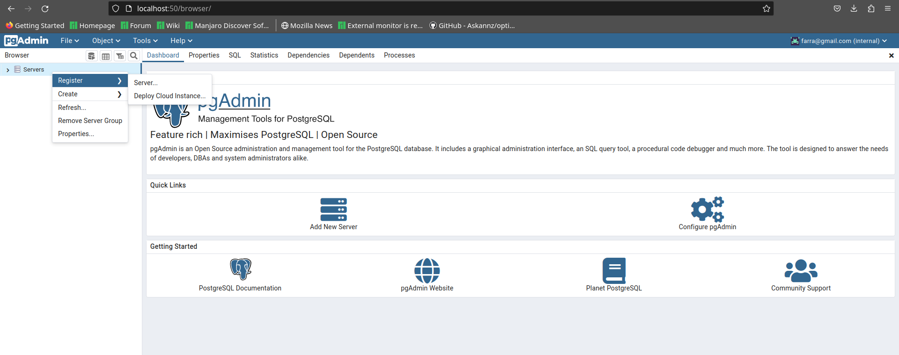
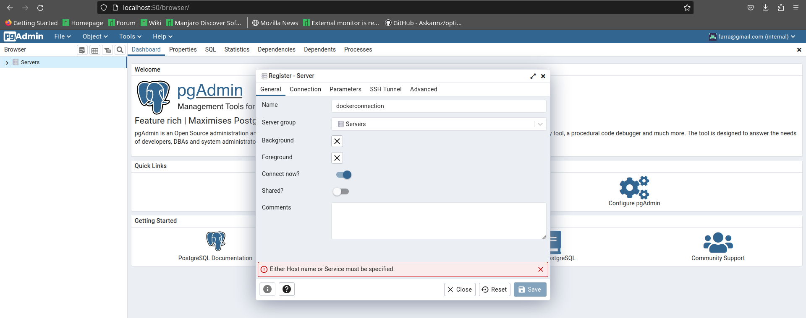
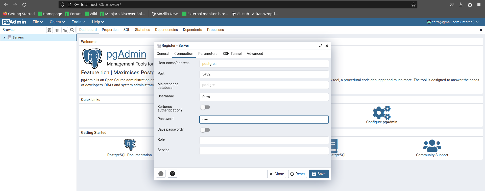
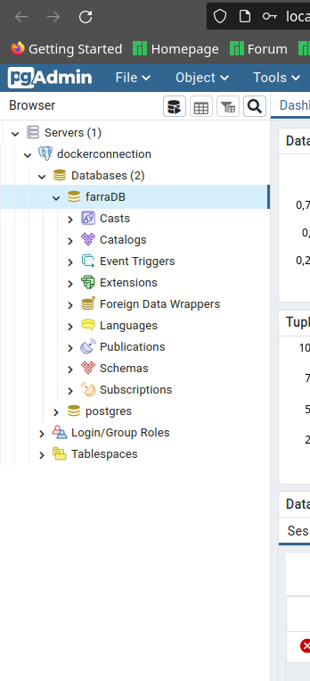

# Ecommerce Api

API para gestión de ecommerce, ofrece servicio como inicio de sesion y registro de usuarios, mostrar usuarios en la base datosm filtrar por id, mostrar productos, insertar productos, crear pedidos y mucho más...

## Seguridad

Esta API esta securizada con las dependecias de Gradle Spring Security Web y Oauth2, entregando al usuario un JsonWebToken temporal.
Debes de tener el token para poder usar los endpoints.

## Como correr Projecto

 ### 1. Entra en la carpeta del proyecto y escribe en el terminal: docker compose up
### 2. Verifica que las imagenes de PostgreSQL y pgadmin estan corriendo correctamente
###    3. El puerto predeterminado es el 50:80, entramos a pgadmin escribiendo localhost:50 (se puede cambiar los puertos en los parametros del docker compose)
    -Nos direcciona a la pagina de logeo, el correo por defecto es:
    farra@gmail.com
    -Y la contraseña es:
    farra

###   4. Una vez logeados hacemos click derecho en Servers, Vamos a la opcion register y clickamos en Server

### 5. En el apartado general solo escribimos
    En apartado name:
    dockerconnection

### 5. Una vez escrito dockerconnection nos vamos al apratodo COnnection a la derecha de general y cambiamos lo siguiente:
    -En Host name/address:
    postgres
    -En username:
    farra
    -En password:
    farra

    Le damos a Save para guardar los datos de la configuración

### 6.Verificamos en Servers que se ha conectado correctamente a la base de datos, en este cado es farra DB en el puerto 5432

## ENDPOINTS

### TOKEN

    http://localhost:8080/token

    Para logearnos y recibir token para realizar cualquier peticion colcoamos un email registrado en el seeder
    y su contraseña
    Ejemplo de usuario que ya existe en el Seeder para tener acceso:
    -holajavi@gmail.com
    -suspenso_01

### GET(OBTENER DATOS)
    
    /users -> Recibe todo los usuarios de la base de datos
    
    /users/{idUsuario} ->Entrega el usuario que coincida con esa id (Ejemplo /users/1 dara el user 1)
    
    /products -> Recibe todos los productos de la base de datos

    /products/{idProducto} ->Entrega el producto que coincida con esa id (Ejemplo /products/1 dara el producto 1)
        
    /orders -> Recibe todos los pedidos que se han realizado y se encuentran de la base de datos

    /orders/{idOrder} ->Entrega el pedido de la id escrita (Ejemplo /orders/1 dara el pedido 1)

### POST(INSERCIÓN DE DATOS)
    /users ->Crea un usuario nuevo

    /products-> Crea un producto nuevo

    /orders-> Genera un pedido nuevo y los respectivos order Items

### PUT(ACTUALIZACIÓN DE DATOS)
    
    /users/{idUser} ->Actualiza todos los datos del usuario con el id numerico de la url

    /products/{idUser}->Actualiza todos los datos del producto que coincide con el id numerico de la url

    /orders/{idUser}-> Actualiza todos los datos del producto que coincide con el id numerico de la url

### DELETE(BORRADO DE DATOS)

    /users/{idUser} ->Borra el usuario de la base datos que coincida con el id numérico proporcionado en la url

    /products/{idProduct} ->Borra el producto de la base datos que coincida con el id numérico proporcionado en la url

    /products/{idOrder} ->Borra el pedido de la base datos que coincida con el id numérico proporcionado en la url
    
