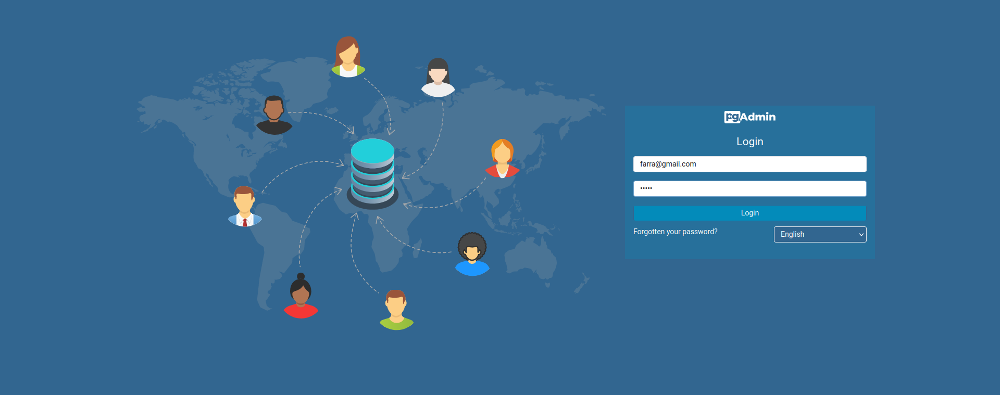

# Ecommerce Api

Application for ecommerce management and services, like registering and logging users,
search products in databases, search users orders and more...

## Security

This API is secured with Spring Security and Oauth2 gradle dependencies, giving a temporal Json Web Token to the user.
You must be logged in the API to use their endpoints.

## How to Run Project

 ### 1. Enter the project folder and write in terminal: docker compose up
### 2. Verify that docker images of porjectoFInalPostgre are running this includes an image of PostgreSQL Database and a image of pgAdmin, a visual user Interface for PostgreSQL managent
###    3. El puerto predeterminado es el 50:80, entramos a pgadmin escribiendo localhost:50 (se puede cambiar los puertos en los parametros del docker compose)
    -Nos direcciona a la pagina de logeo, el correo por defecto es:
    farra@gmail.com
    -Y la contraseña es:
    farra

###   4. Una vez logeados hacemos click derecho en Servers, Vamos a la opcion register y clickamos en Server

### 5. En el apartado general solo escribimos
    En apartado name:
    dockerconnection

### 5. Una vez escrito dockerconnection nos vamos al apratodo COnnection a la derecha de general y cambiamos lo siguiente:
    -En Host name/address:
    postgres
    -En username:
    farra
    -En password:
    farra

    Le damos a Save para guardar los datos de la configuración

### 6Verificamos en Servers que se ha conectado correctamente a la base de datos, en este cado es farra DB en el puerto 5432

